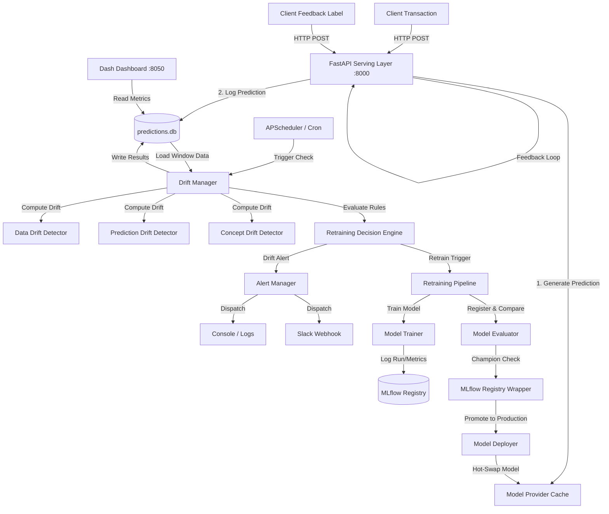

# MLOps Platform Architecture

This document describes the design, data flows, components, and communication protocols of the MLOps Model Drift Monitor & Automated Retraining Platform.

---

## 1. System Overview

The platform is designed to handle the complete machine learning lifecycle in production: serving inferences, logging request metadata, monitoring statistical and performance drift, alerting on degradation, and automatically triggering retraining workflows.

---

## 2. Core Components

### 2.1 Serving Layer (FastAPI)
- **Port:** `8000`
- **Predict Endpoint (`/predict`):** Executes latency-optimized RandomForest inference using standard feature schemas.
- **Batch Predict Endpoint (`/predict/batch`):** Processes batch predictions in a single transaction.
- **Feedback Endpoint (`/ground-truth/{prediction_id}`):** Accepts true labels asynchronously to allow concept drift (performance) computation.
- **Lifespan Manager:** Dynamically initializes database connections, registers drift detectors, starts the periodic scheduler, and pre-loads the production model from the registry.

### 2.2 Monitoring & Drift Detection Engine
Executes statistical drift tests over a sliding window (default: 500 samples) comparing current traffic to baseline distributions.
- **Data Drift:** Evaluates covariate shift using Population Stability Index (PSI) and Kullback-Leibler (KL) Divergence per feature.
- **Prediction Drift:** Tracks target distribution changes using Hellinger Distance on confidence scores and output classes.
- **Concept Drift:** Measures metric degradation (accuracy, F1, precision, recall) relative to reference thresholds.

### 2.3 Alerting & Decision Engine
- **Alert Manager:** Dispatches formatted messages to enabled alerting channels (stdout, Slack webhook, SMTP email) with deduplication logic to avoid alert fatigue.
- **Retraining Decision Engine:** Applies rule-based triggers to compute action urgency:
  - Urgency **HIGH** -> Triggers immediate background retraining (e.g., PSI > 0.25 or F1 drop > 0.05).
  - Urgency **MEDIUM** -> Triggers retraining or flags for manual review.

### 2.4 Retraining Pipeline
- Automatically combines original baseline dataset with recent drifted transaction records.
- Fits a new model, logs parameters and Plotly artifacts (confusion matrix and feature importances) to MLflow.
- Evaluates the candidate against the current production model.
- If validated, registers it, updates the production model alias in the MLflow registry, and triggers an atomic model hot-swap in the serving layer.

### 2.5 Visualization Layer (Plotly Dash)
- **Port:** `8050`
- Provides a dark-themed glassmorphism interface.
- Renders live-updating metrics (interval: 5000ms), distribution graphs, PSI heatmaps, model versions comparison, and alert histories directly from the SQLite database.

---

## 3. Database Schema (SQLite)

- **`predictions`**: Logged transaction details, predictions, and ground-truth values.
- **`drift_results`**: Historical computed metrics and thresholds.
- **`alerts`**: Recorded and dispatched system warnings/critical logs.
- **`model_versions`**: Mirror of MLflow registry versions, training dates, and production statuses.
- **`retraining_events`**: Audit trail of retraining jobs, trigger reasons, and status results.
