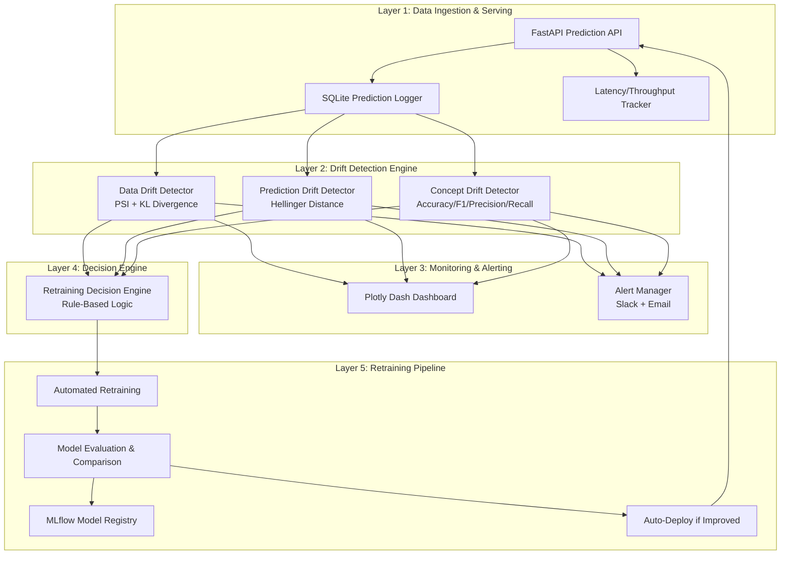
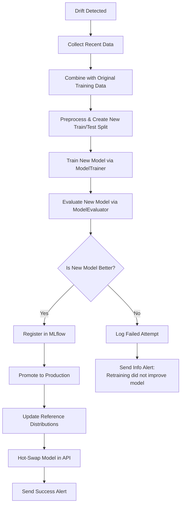
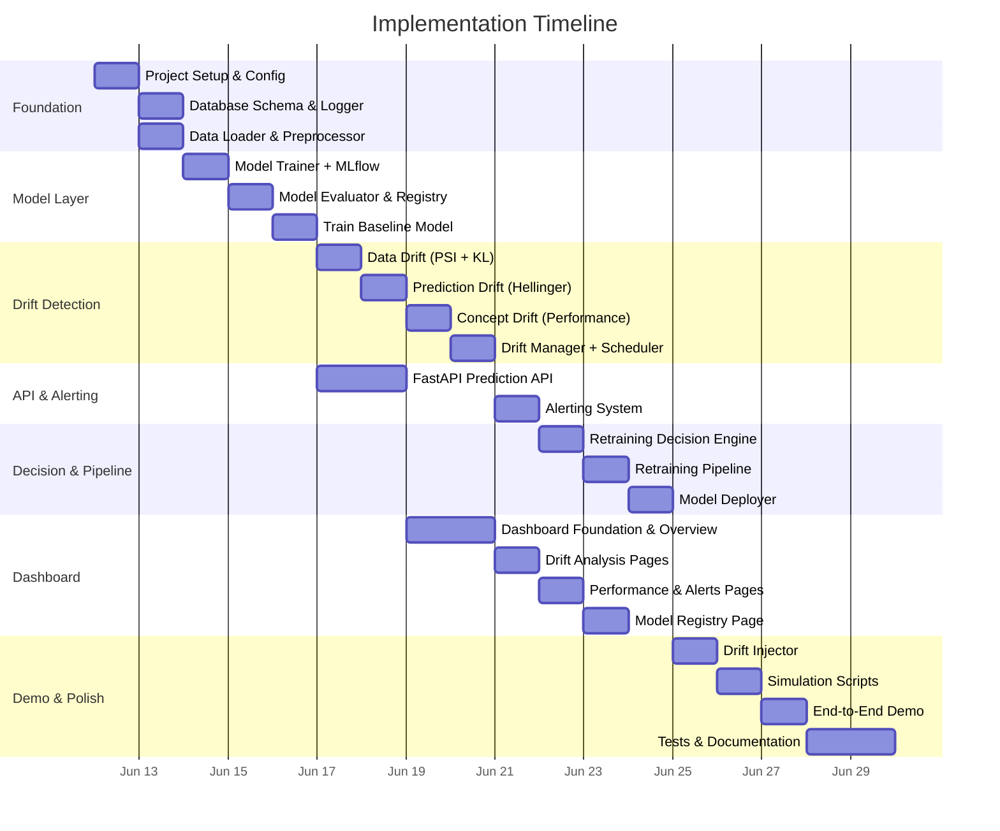

# ML Model Drift Monitor & Automated Retraining Platform

## Implementation Plan

A production-inspired MLOps platform that continuously monitors deployed ML models, detects performance degradation through data/prediction/concept drift, alerts stakeholders, and automatically triggers retraining workflows when predefined thresholds are exceeded.

---

## Project Architecture Overview



---

## Technology Stack

| Component | Technology | Rationale |
|:---|:---|:---|
| **Language** | Python 3.11+ | Industry standard for ML |
| **Prediction API** | FastAPI | High-performance async API with auto-docs |
| **ML Framework** | Scikit-Learn | Simple, effective for tabular data |
| **Experiment Tracking** | MLflow | Industry standard model registry + tracking |
| **Dashboard** | Plotly Dash | Interactive, Python-native dashboards |
| **Database** | SQLite | Zero-config, file-based, portfolio-friendly |
| **Scheduling** | APScheduler | Lightweight periodic drift checks |
| **Alerting** | Slack Webhooks + SMTP | Real-world notification channels |
| **Configuration** | Pydantic + YAML | Type-safe, validated configuration |
| **Testing** | Pytest | Standard Python testing |
| **Dataset** | Credit Card Fraud (Kaggle) | Real-world binary classification with class imbalance |

---

## Project Directory Structure

```
MLOPS/
├── README.md                          # Project documentation
├── pyproject.toml                     # Dependencies & project metadata
├── requirements.txt                   # Pinned dependencies
├── setup.py                           # Package installation
├── .env.example                       # Environment variable template
├── .gitignore
│
├── configs/                           # Configuration files
│   ├── base_config.yaml               # Base platform configuration
│   ├── drift_thresholds.yaml          # Drift detection thresholds
│   └── alerting_config.yaml           # Alert channel configuration
│
├── data/                              # Data storage (gitignored)
│   ├── raw/                           # Raw dataset downloads
│   ├── processed/                     # Preprocessed data
│   ├── reference/                     # Baseline distributions for drift
│   └── predictions.db                 # SQLite prediction log
│
├── models/                            # Saved model artifacts (gitignored)
│   └── baseline/                      # Initial baseline model
│
├── mlruns/                            # MLflow tracking (gitignored)
│
├── src/                               # Core application source code
│   ├── __init__.py
│   │
│   ├── config/                        # Configuration management
│   │   ├── __init__.py
│   │   └── settings.py                # Pydantic settings models
│   │
│   ├── data/                          # Data layer
│   │   ├── __init__.py
│   │   ├── database.py                # SQLite connection & schema
│   │   ├── logger.py                  # Prediction event logger
│   │   ├── loader.py                  # Dataset loading & preprocessing
│   │   └── drift_injector.py          # Synthetic drift injection
│   │
│   ├── models/                        # Model layer
│   │   ├── __init__.py
│   │   ├── trainer.py                 # Model training pipeline
│   │   ├── evaluator.py              # Model evaluation & comparison
│   │   └── registry.py               # MLflow model registry wrapper
│   │
│   ├── monitoring/                    # Drift detection layer
│   │   ├── __init__.py
│   │   ├── data_drift.py             # PSI & KL Divergence
│   │   ├── prediction_drift.py       # Hellinger Distance
│   │   ├── concept_drift.py          # Performance metric tracking
│   │   └── drift_manager.py          # Orchestrates all drift checks
│   │
│   ├── alerting/                      # Alert layer
│   │   ├── __init__.py
│   │   ├── alert_manager.py          # Central alert dispatcher
│   │   ├── slack_notifier.py         # Slack webhook integration
│   │   └── email_notifier.py         # SMTP email integration
│   │
│   ├── decision/                      # Decision engine
│   │   ├── __init__.py
│   │   └── retraining_engine.py      # Rule-based retrain decision
│   │
│   ├── pipeline/                      # Retraining pipeline
│   │   ├── __init__.py
│   │   ├── retrain_pipeline.py       # End-to-end retraining workflow
│   │   └── deployer.py               # Model deployment logic
│   │
│   ├── api/                           # FastAPI serving layer
│   │   ├── __init__.py
│   │   ├── app.py                     # FastAPI application factory
│   │   ├── routes/
│   │   │   ├── __init__.py
│   │   │   ├── predictions.py         # /predict endpoint
│   │   │   ├── monitoring.py          # /monitoring/* endpoints
│   │   │   ├── models.py             # /models/* endpoints
│   │   │   └── health.py             # /health endpoint
│   │   ├── schemas.py                 # Pydantic request/response models
│   │   └── middleware.py              # Logging & timing middleware
│   │
│   └── dashboard/                     # Plotly Dash dashboard
│       ├── __init__.py
│       ├── app.py                     # Dash application factory
│       ├── layouts/
│       │   ├── __init__.py
│       │   ├── overview.py            # Main overview page
│       │   ├── data_drift.py          # Data drift analysis page
│       │   ├── prediction_drift.py    # Prediction drift page
│       │   ├── performance.py         # Model performance page
│       │   ├── alerts.py             # Alert history page
│       │   └── model_registry.py     # Model version history page
│       ├── components/
│       │   ├── __init__.py
│       │   ├── navbar.py              # Navigation bar
│       │   ├── metric_card.py         # KPI metric cards
│       │   ├── trend_chart.py         # Time-series trend charts
│       │   └── alert_badge.py         # Alert status badges
│       └── callbacks/
│           ├── __init__.py
│           ├── overview_callbacks.py
│           ├── drift_callbacks.py
│           └── performance_callbacks.py
│
├── scripts/                           # Utility scripts
│   ├── setup_data.py                  # Download & prepare dataset
│   ├── train_baseline.py             # Train initial baseline model
│   ├── simulate_production.py        # Simulate production traffic
│   ├── inject_drift.py               # Inject synthetic drift
│   └── run_demo.py                   # Full end-to-end demo script
│
├── tests/                             # Test suite
│   ├── __init__.py
│   ├── test_drift_detection.py
│   ├── test_prediction_api.py
│   ├── test_retraining_pipeline.py
│   ├── test_decision_engine.py
│   └── test_data_logger.py
│
├── notebooks/                         # Exploratory notebooks
│   ├── 01_data_exploration.ipynb
│   ├── 02_drift_analysis.ipynb
│   └── 03_pipeline_demo.ipynb
│
└── docs/                              # Documentation
    ├── architecture.md
    ├── api_reference.md
    └── setup_guide.md
```

---

## Detailed Implementation Plan

### Phase 1: Foundation & Data Infrastructure

> [!IMPORTANT]
> This phase establishes the entire project skeleton, configuration system, database schema, and data pipeline. Everything else builds on top of this.

---

#### [NEW] [pyproject.toml](file:///d:/AI%20STUFF/PROJECTS/MLOPS/pyproject.toml)

Project metadata and dependency management using modern Python packaging standards.

**Key dependencies:**
```
fastapi>=0.115.0
uvicorn[standard]>=0.30.0
mlflow>=2.16.0
scikit-learn>=1.5.0
pandas>=2.2.0
numpy>=1.26.0
dash>=2.18.0
plotly>=5.24.0
dash-bootstrap-components>=1.6.0
pydantic>=2.9.0
pydantic-settings>=2.5.0
pyyaml>=6.0
sqlalchemy>=2.0
aiosqlite>=0.20.0
apscheduler>=3.10.0
requests>=2.32.0
httpx>=0.27.0
python-dotenv>=1.0.0
joblib>=1.4.0
pytest>=8.3.0
pytest-asyncio>=0.24.0
```

---

#### [NEW] [configs/base_config.yaml](file:///d:/AI%20STUFF/PROJECTS/MLOPS/configs/base_config.yaml)

Central configuration file defining all platform parameters.

```yaml
project:
  name: "MLOps Drift Monitor"
  version: "1.0.0"

database:
  url: "sqlite:///data/predictions.db"
  
mlflow:
  tracking_uri: "sqlite:///mlruns/mlflow.db"
  experiment_name: "drift-monitor"
  artifact_location: "./models"
  
model:
  name: "FraudDetector"
  type: "RandomForestClassifier"
  
api:
  host: "0.0.0.0"
  port: 8000
  
dashboard:
  host: "0.0.0.0"  
  port: 8050
  refresh_interval_ms: 5000

monitoring:
  check_interval_minutes: 5
  window_size: 500        # Number of recent predictions per window
  min_samples: 100        # Minimum samples before drift check
```

---

#### [NEW] [configs/drift_thresholds.yaml](file:///d:/AI%20STUFF/PROJECTS/MLOPS/configs/drift_thresholds.yaml)

Externalized, tunable drift thresholds — separated from code for easy adjustment.

```yaml
data_drift:
  psi:
    warning: 0.10
    critical: 0.25
  kl_divergence:
    warning: 0.05
    critical: 0.15

prediction_drift:
  hellinger:
    warning: 0.10
    critical: 0.20
  distribution_shift:
    warning: 0.05
    critical: 0.15

concept_drift:
  accuracy_drop:
    warning: 0.03       # 3% drop from baseline
    critical: 0.05      # 5% drop from baseline
  f1_drop:
    warning: 0.03
    critical: 0.05
  precision_drop:
    warning: 0.05
    critical: 0.10
  recall_drop:
    warning: 0.05
    critical: 0.10
```

---

#### [NEW] [src/config/settings.py](file:///d:/AI%20STUFF/PROJECTS/MLOPS/src/config/settings.py)

Pydantic settings models that load YAML configs + environment variables with type validation.

**Key classes:**
- `DatabaseSettings` — DB URL, pool size
- `MLflowSettings` — tracking URI, experiment name, artifact root
- `DriftThresholds` — all threshold values as typed, validated fields
- `AlertSettings` — Slack webhook URL, email SMTP config
- `AppSettings` — top-level settings aggregator with `from_yaml()` classmethod

**Design decisions:**
- Use `pydantic-settings` for env var override support (e.g., `MLFLOW_TRACKING_URI` overrides YAML)
- Singleton pattern for global config access
- All thresholds accessible as `settings.drift.data_drift.psi.critical`

---

#### [NEW] [src/data/database.py](file:///d:/AI%20STUFF/PROJECTS/MLOPS/src/data/database.py)

SQLAlchemy-based database layer with SQLite backend.

**Tables:**

| Table | Purpose | Key Columns |
|:---|:---|:---|
| `predictions` | Every prediction event | `id, timestamp, model_version, features_json, predicted_label, confidence, true_label, latency_ms` |
| `drift_results` | Drift check results over time | `id, timestamp, drift_type, metric_name, metric_value, threshold, is_breached, window_start, window_end` |
| `alerts` | Alert history | `id, timestamp, severity, drift_type, message, channel, acknowledged` |
| `model_versions` | Model registry mirror | `id, version, mlflow_run_id, accuracy, f1_score, precision, recall, training_date, is_production, deployed_at` |
| `retraining_events` | Retraining audit log | `id, timestamp, trigger_reason, old_version, new_version, old_f1, new_f1, status` |

**Implementation details:**
- Use SQLAlchemy ORM with declarative base
- Session factory with context manager for safe transactions
- `init_db()` function to create all tables on first run
- Index on `predictions.timestamp` and `predictions.model_version` for efficient range queries

---

#### [NEW] [src/data/logger.py](file:///d:/AI%20STUFF/PROJECTS/MLOPS/src/data/logger.py)

Prediction event logger — the central source of truth.

**Key functions:**
- `log_prediction(features, predicted_label, confidence, model_version, latency_ms)` — stores a prediction event with auto-timestamp
- `log_ground_truth(prediction_id, true_label)` — updates a prediction with delayed ground truth
- `get_predictions(start_time, end_time, model_version)` — retrieves predictions for a time window
- `get_recent_predictions(n)` — retrieves the last N predictions
- `get_prediction_stats()` — returns throughput, avg latency, total count

**Design decisions:**
- Batch insert support for simulation mode (bulk inserts via `session.add_all()`)
- JSON serialization of features for flexible schema storage
- Thread-safe session management

---

#### [NEW] [src/data/loader.py](file:///d:/AI%20STUFF/PROJECTS/MLOPS/src/data/loader.py)

Dataset loading and preprocessing pipeline.

**Dataset: Credit Card Fraud Detection**
- Source: Kaggle (`creditcardfraud` dataset) — 284,807 transactions, 492 frauds (0.172%)
- Features: V1–V28 (PCA-transformed), Amount, Time
- Target: `Class` (0 = legitimate, 1 = fraud)

**Key functions:**
- `load_dataset()` — downloads/loads the dataset, returns DataFrame
- `preprocess(df)` — handles scaling (`StandardScaler` on Amount/Time), creates train/test split
- `create_reference_distribution(X_train)` — saves baseline feature distributions for drift detection
- `get_feature_names()` — returns the ordered list of feature names

**Preprocessing pipeline:**
1. Drop `Time` column (or normalize it)
2. `StandardScaler` on `Amount`
3. Stratified train/test split (80/20) preserving class imbalance
4. Save reference distributions as numpy arrays in `data/reference/`
5. Save preprocessing pipeline as a joblib artifact

---

#### [NEW] [src/data/drift_injector.py](file:///d:/AI%20STUFF/PROJECTS/MLOPS/src/data/drift_injector.py)

Synthetic drift injection engine — critical for demonstrating the platform's capabilities.

**Drift scenarios:**

| Scenario | Type | Method | Expected Impact |
|:---|:---|:---|:---|
| **Feature Shift** | Data Drift | Add mean shift to V1–V5 features (+1.5σ) | PSI > 0.25 |
| **Scale Change** | Data Drift | Multiply Amount by 3x | PSI > 0.10 |
| **Noise Injection** | Data Drift | Add Gaussian noise (σ=0.5) to all features | PSI ≈ 0.10–0.20 |
| **Label Flip** | Concept Drift | Randomly flip 15–20% of labels | F1 drops by >5% |
| **Class Imbalance Shift** | Prediction Drift | Oversample fraud class from 0.17% to 5% | Prediction distribution shifts |
| **Gradual Drift** | Mixed | Linearly interpolate features over N batches | Slow PSI increase |

**Key functions:**
- `inject_feature_shift(X, features, shift_magnitude)` — adds constant shift to specified features
- `inject_scale_change(X, features, scale_factor)` — multiplies features by a scaling factor
- `inject_noise(X, noise_std)` — adds Gaussian noise to all features
- `inject_label_flip(y, flip_ratio)` — randomly flips a percentage of labels
- `inject_gradual_drift(X, n_batches, max_shift)` — creates batches with increasing drift
- `create_drifted_dataset(X, y, scenario)` — applies a named scenario from the table above

---

### Phase 2: Model Training & MLflow Integration

> [!IMPORTANT]
> This phase establishes the ML model, experiment tracking, and model registry. The baseline model trained here becomes the "production model" that we then monitor for drift.

---

#### [NEW] [src/models/trainer.py](file:///d:/AI%20STUFF/PROJECTS/MLOPS/src/models/trainer.py)

Model training pipeline with full MLflow integration.

**Training workflow:**
1. Load preprocessed data from `data/processed/`
2. Start MLflow run under experiment `drift-monitor`
3. Train `RandomForestClassifier` with configurable hyperparameters
4. Log all hyperparameters: `n_estimators`, `max_depth`, `min_samples_split`, `class_weight`
5. Evaluate on test set → log metrics: accuracy, F1, precision, recall, AUC-ROC
6. Log confusion matrix as artifact image
7. Log feature importance plot as artifact
8. Save model with `mlflow.sklearn.log_model()` with inferred signature
9. Return run ID and metrics dict

**Key classes:**
- `ModelTrainer` — orchestrates the training workflow
  - `train(X_train, y_train, X_test, y_test, params)` → `TrainingResult`
  - `hyperparameter_search(X_train, y_train, param_grid)` → best params
  
**Design decisions:**
- Use `class_weight='balanced'` by default for the imbalanced fraud dataset
- Use `mlflow.sklearn.autolog()` for automatic parameter/metric logging
- Save the full sklearn pipeline (scaler + model) as a single artifact
- Default hyperparameters: `n_estimators=200, max_depth=15, min_samples_split=5`

---

#### [NEW] [src/models/evaluator.py](file:///d:/AI%20STUFF/PROJECTS/MLOPS/src/models/evaluator.py)

Model evaluation and champion-challenger comparison.

**Key functions:**
- `evaluate_model(model, X_test, y_test)` → `EvaluationResult(accuracy, f1, precision, recall, auc_roc, confusion_matrix)`
- `compare_models(current_result, new_result)` → `ComparisonResult(is_improved, metric_deltas, recommendation)`
- `generate_evaluation_report(result)` → logs metrics, plots, and artifacts to MLflow

**Comparison logic:**
```
IF new_f1 > current_f1 AND new_accuracy >= current_accuracy * 0.98:
    → DEPLOY new model
ELIF new_f1 > current_f1 * 1.02:
    → DEPLOY new model (significant F1 improvement outweighs slight accuracy drop)
ELSE:
    → KEEP current model
```

**Artifacts generated:**
- Confusion matrix heatmap (plotly)
- ROC curve (plotly)
- Precision-Recall curve
- Classification report (text)
- Feature importance bar chart

---

#### [NEW] [src/models/registry.py](file:///d:/AI%20STUFF/PROJECTS/MLOPS/src/models/registry.py)

MLflow Model Registry wrapper for version management.

**Key functions:**
- `register_model(run_id, model_name)` → registers a trained model, returns version number
- `promote_to_production(model_name, version)` → transitions model to "Production" stage
- `get_production_model(model_name)` → loads the current production model
- `get_model_history(model_name)` → returns all versions with metrics and dates
- `archive_model(model_name, version)` → transitions old model to "Archived" stage
- `load_model(model_name, version=None, stage=None)` → loads a specific model version

**Design decisions:**
- Use MLflow's `MlflowClient` for programmatic registry operations
- Mirror key metadata (version, metrics, dates) to the local SQLite `model_versions` table for dashboard queries
- Support both version-based and stage-based model loading

---

#### [NEW] [scripts/train_baseline.py](file:///d:/AI%20STUFF/PROJECTS/MLOPS/scripts/train_baseline.py)

Script to train and register the initial baseline model.

**Workflow:**
1. Call `loader.load_dataset()` and `loader.preprocess()`
2. Call `trainer.train()` with default hyperparameters
3. Call `registry.register_model()` to register as v1
4. Call `registry.promote_to_production()` to set as production model
5. Call `loader.create_reference_distribution()` to save baseline distributions
6. Print summary with metrics and model URI

---

### Phase 3: Drift Detection Engine

> [!IMPORTANT]
> This is the core intellectual component of the project. Each drift detector implements statistical tests that compare current data windows against the training baseline.

---

#### [NEW] [src/monitoring/data_drift.py](file:///d:/AI%20STUFF/PROJECTS/MLOPS/src/monitoring/data_drift.py)

Data drift detection using PSI and KL Divergence.

**Population Stability Index (PSI):**

$$\text{PSI} = \sum_{i=1}^{B} \left( p_i^{actual} - p_i^{expected} \right) \cdot \ln\left(\frac{p_i^{actual}}{p_i^{expected}}\right)$$

**Implementation:**
```python
def calculate_psi(expected, actual, bins=10):
    """Calculate PSI between baseline and current distributions."""
    # Use quantile-based binning from expected distribution
    bin_edges = np.quantile(expected, np.linspace(0, 1, bins + 1))
    
    expected_counts = np.histogram(expected, bins=bin_edges)[0]
    actual_counts = np.histogram(actual, bins=bin_edges)[0]
    
    # Add epsilon to avoid division by zero
    epsilon = 1e-6
    expected_pct = expected_counts / len(expected) + epsilon
    actual_pct = actual_counts / len(actual) + epsilon
    
    psi = np.sum((actual_pct - expected_pct) * np.log(actual_pct / expected_pct))
    return psi
```

**KL Divergence (bonus metric):**

$$D_{KL}(P \| Q) = \sum_i P(i) \cdot \ln\left(\frac{P(i)}{Q(i)}\right)$$

**Key class: `DataDriftDetector`**
- `__init__(reference_data, thresholds)` — stores baseline distributions
- `check_drift(current_data)` → `DriftResult(psi_values, kl_values, is_drifted, drifted_features, severity)`
- `get_feature_psi(feature_name)` → PSI for a single feature
- `get_top_drifted_features(n)` → top N features by PSI value

**Interpretation thresholds:**
- PSI < 0.10 → ✅ No drift
- PSI 0.10–0.25 → ⚠️ Moderate drift (warning)
- PSI > 0.25 → 🔴 Significant drift (critical)

---

#### [NEW] [src/monitoring/prediction_drift.py](file:///d:/AI%20STUFF/PROJECTS/MLOPS/src/monitoring/prediction_drift.py)

Prediction drift detection using Hellinger Distance and distribution comparison.

**Hellinger Distance:**

$$H(P, Q) = \frac{1}{\sqrt{2}} \sqrt{\sum_{i=1}^{k} \left(\sqrt{p_i} - \sqrt{q_i}\right)^2}$$

**Key class: `PredictionDriftDetector`**
- `__init__(baseline_predictions, thresholds)` — stores baseline prediction distribution
- `check_drift(current_predictions)` → `PredictionDriftResult(hellinger_distance, baseline_mean, current_mean, baseline_positive_rate, current_positive_rate, is_drifted, severity)`
- `compare_confidence_distributions(baseline_confs, current_confs)` → histogram comparison
- `get_prediction_rate_change()` → percentage change in positive prediction rate

**What this detects:**
- Model suddenly predicting many more positives (fraud) than baseline
- Confidence score distribution shifting (model becoming more/less certain)
- Prediction bias changes

---

#### [NEW] [src/monitoring/concept_drift.py](file:///d:/AI%20STUFF/PROJECTS/MLOPS/src/monitoring/concept_drift.py)

Concept drift detection using actual model performance metrics.

> [!NOTE]
> Concept drift requires ground truth labels. In production, these arrive with a delay. Our system handles this by checking only predictions where `true_label IS NOT NULL`.

**Key class: `ConceptDriftDetector`**
- `__init__(baseline_metrics, thresholds)` — stores baseline accuracy, F1, precision, recall
- `check_drift(y_true, y_pred)` → `ConceptDriftResult(current_metrics, baseline_metrics, metric_deltas, is_drifted, degraded_metrics, severity)`
- `calculate_rolling_metrics(predictions_df, window_size)` → rolling metric calculations
- `get_metric_trend(metric_name, n_windows)` → time-series of a metric

**Metrics tracked:**
- Accuracy: `(TP + TN) / (TP + TN + FP + FN)`
- F1 Score: `2 * (Precision * Recall) / (Precision + Recall)`
- Precision: `TP / (TP + FP)`
- Recall: `TP / (TP + FN)`

**Drift detection rule:**
```
IF (baseline_f1 - current_f1) > threshold:
    → Concept drift detected
```

---

#### [NEW] [src/monitoring/drift_manager.py](file:///d:/AI%20STUFF/PROJECTS/MLOPS/src/monitoring/drift_manager.py)

Central orchestrator that runs all drift checks on a schedule.

**Key class: `DriftManager`**
- `__init__(db, data_detector, prediction_detector, concept_detector, alert_manager, decision_engine)`
- `run_drift_check()` — executes all three drift detectors, stores results, triggers alerts if needed
- `schedule_monitoring(interval_minutes)` — sets up APScheduler for periodic checks
- `get_drift_summary()` → aggregated health status across all drift types
- `get_drift_history(drift_type, n_results)` → historical drift results

**Orchestration flow:**
```
1. Query last N predictions from DB
2. Run DataDriftDetector.check_drift()
3. Run PredictionDriftDetector.check_drift()
4. Run ConceptDriftDetector.check_drift() (if ground truth available)
5. Store all results in drift_results table
6. If any drift breaches thresholds → alert_manager.send_alert()
7. If any critical drift → decision_engine.evaluate()
8. Return aggregated DriftSummary
```

---

### Phase 4: Alerting System

---

#### [NEW] [src/alerting/alert_manager.py](file:///d:/AI%20STUFF/PROJECTS/MLOPS/src/alerting/alert_manager.py)

Central alert dispatcher that routes alerts to configured channels.

**Key class: `AlertManager`**
- `send_alert(severity, drift_type, metric_name, metric_value, threshold, message)`
- `get_active_alerts()` → unacknowledged alerts
- `acknowledge_alert(alert_id)`
- `get_alert_history(limit)` → recent alerts

**Severity levels:**
- `WARNING` — metric approaching threshold (yellow)
- `CRITICAL` — metric exceeded threshold (red)
- `RESOLVED` — previously breached metric returned to normal (green)

**Alert message format:**
```
🔴 CRITICAL: Data Drift Detected
━━━━━━━━━━━━━━━━━━━━━━━━
Metric: PSI (Feature: V1)
Value: 0.31
Threshold: 0.25
Model: FraudDetector v3
Time: 2026-06-12 17:30:00 UTC
━━━━━━━━━━━━━━━━━━━━━━━━
Action: Retraining pipeline triggered
```

---

#### [NEW] [src/alerting/slack_notifier.py](file:///d:/AI%20STUFF/PROJECTS/MLOPS/src/alerting/slack_notifier.py)

Slack integration via incoming webhooks.

**Implementation:**
- Uses `requests` to POST to Slack webhook URL
- Formats alerts as Slack Block Kit messages with color-coded severity
- Includes action buttons (Acknowledge, View Dashboard)
- Falls back gracefully if webhook URL not configured (logs to console instead)

---

#### [NEW] [src/alerting/email_notifier.py](file:///d:/AI%20STUFF/PROJECTS/MLOPS/src/alerting/email_notifier.py)

Email notification via SMTP.

**Implementation:**
- Uses Python's `smtplib` and `email.mime`
- HTML-formatted email with metrics table
- Configurable recipients list
- Optional — only activates if SMTP settings are provided in config

---

### Phase 5: Retraining Decision Engine

---

#### [NEW] [src/decision/retraining_engine.py](file:///d:/AI%20STUFF/PROJECTS/MLOPS/src/decision/retraining_engine.py)

Rule-based decision engine that determines whether retraining is needed.

**Key class: `RetrainingDecisionEngine`**
- `evaluate(drift_summary)` → `RetrainingDecision(should_retrain, reason, urgency, triggered_rules)`
- `get_decision_history()` → past decisions and outcomes

**Decision rules (configurable via YAML):**

```python
RULES = [
    # Rule 1: Critical data drift
    {
        "name": "critical_data_drift",
        "condition": "max_psi > thresholds.data_drift.psi.critical",
        "action": "RETRAIN",
        "urgency": "HIGH",
        "reason": "Significant data distribution shift detected (PSI={value})"
    },
    # Rule 2: Performance degradation
    {
        "name": "f1_degradation",
        "condition": "f1_drop > thresholds.concept_drift.f1_drop.critical",
        "action": "RETRAIN",
        "urgency": "HIGH",
        "reason": "F1 score dropped by {value}% from baseline"
    },
    # Rule 3: Moderate data drift + any performance drop
    {
        "name": "moderate_drift_with_perf_drop",
        "condition": "max_psi > 0.10 AND f1_drop > 0.02",
        "action": "RETRAIN",
        "urgency": "MEDIUM",
        "reason": "Moderate drift with early performance degradation"
    },
    # Rule 4: Prediction distribution shift
    {
        "name": "prediction_shift",
        "condition": "hellinger_distance > thresholds.prediction_drift.hellinger.critical",
        "action": "FLAG_FOR_REVIEW",
        "urgency": "MEDIUM",
        "reason": "Prediction distribution has shifted significantly"
    },
    # Rule 5: Sustained moderate drift
    {
        "name": "sustained_moderate_drift",
        "condition": "consecutive_warning_checks >= 3",
        "action": "RETRAIN",
        "urgency": "MEDIUM",
        "reason": "Moderate drift sustained over 3 consecutive checks"
    }
]
```

**Decision output:**
```python
@dataclass
class RetrainingDecision:
    should_retrain: bool
    action: str           # "RETRAIN", "FLAG_FOR_REVIEW", "NO_ACTION"
    urgency: str          # "HIGH", "MEDIUM", "LOW"
    reason: str
    triggered_rules: list
    timestamp: datetime
```

---

### Phase 6: Automated Retraining Pipeline

---

#### [NEW] [src/pipeline/retrain_pipeline.py](file:///d:/AI%20STUFF/PROJECTS/MLOPS/src/pipeline/retrain_pipeline.py)

End-to-end automated retraining workflow.

**Key class: `RetrainingPipeline`**
- `execute(trigger_reason)` → `RetrainingResult`

**Workflow steps:**



**Implementation details:**
1. **Data collection**: Query recent predictions with ground truth from SQLite
2. **Data augmentation**: Combine recent production data with original training data (configurable ratio)
3. **Training**: Use `ModelTrainer.train()` with same or tuned hyperparameters
4. **Evaluation**: Use `ModelEvaluator.compare_models()` against current production model
5. **Deployment gate**: Only deploy if new model passes the comparison criteria
6. **Hot-swap**: Update the in-memory model reference in FastAPI without restart
7. **Audit**: Log the entire retraining event in `retraining_events` table

---

#### [NEW] [src/pipeline/deployer.py](file:///d:/AI%20STUFF/PROJECTS/MLOPS/src/pipeline/deployer.py)

Model deployment manager.

**Key class: `ModelDeployer`**
- `deploy(model_name, version)` → loads new model, updates API, creates deployment record
- `rollback(model_name, version)` → reverts to a previous model version
- `get_deployment_history()` → list of all deployments

**Hot-swap mechanism:**
- The FastAPI app holds a reference to the current model object
- On deployment, the deployer atomically swaps this reference
- No server restart required — zero-downtime deployment simulation

---

### Phase 7: FastAPI Prediction API

---

#### [NEW] [src/api/app.py](file:///d:/AI%20STUFF/PROJECTS/MLOPS/src/api/app.py)

FastAPI application factory with middleware, lifecycle management, and route registration.

**Startup lifecycle:**
1. Initialize database & create tables
2. Load production model from MLflow registry
3. Load reference distributions for drift detection
4. Initialize drift detectors and decision engine
5. Start APScheduler for periodic monitoring
6. Register all routes

**Shutdown lifecycle:**
1. Stop APScheduler
2. Close database connections
3. Log shutdown event

---

#### [NEW] [src/api/routes/predictions.py](file:///d:/AI%20STUFF/PROJECTS/MLOPS/src/api/routes/predictions.py)

**Endpoints:**

| Method | Path | Description |
|:---|:---|:---|
| `POST` | `/predict` | Make a prediction, log event, return result |
| `POST` | `/predict/batch` | Batch prediction for multiple inputs |
| `POST` | `/ground-truth/{prediction_id}` | Submit delayed ground truth label |
| `GET` | `/predictions` | Query prediction history (with pagination) |
| `GET` | `/predictions/stats` | Get prediction throughput and latency stats |

**`/predict` request/response:**
```json
// Request
{
  "features": {
    "V1": -1.36, "V2": -0.07, "V3": 2.53, ...,
    "V28": -0.02, "Amount": 149.62
  }
}

// Response
{
  "prediction_id": "pred_a1b2c3",
  "predicted_label": 0,
  "confidence": 0.94,
  "model_version": "v3",
  "latency_ms": 12.4,
  "timestamp": "2026-06-12T17:30:00Z"
}
```

---

#### [NEW] [src/api/routes/monitoring.py](file:///d:/AI%20STUFF/PROJECTS/MLOPS/src/api/routes/monitoring.py)

**Endpoints:**

| Method | Path | Description |
|:---|:---|:---|
| `GET` | `/monitoring/drift/latest` | Latest drift check results |
| `GET` | `/monitoring/drift/history` | Historical drift metrics |
| `POST` | `/monitoring/drift/run` | Manually trigger a drift check |
| `GET` | `/monitoring/health` | Overall model health status |
| `GET` | `/monitoring/alerts` | Active and historical alerts |

---

#### [NEW] [src/api/routes/models.py](file:///d:/AI%20STUFF/PROJECTS/MLOPS/src/api/routes/models.py)

**Endpoints:**

| Method | Path | Description |
|:---|:---|:---|
| `GET` | `/models/current` | Current production model info |
| `GET` | `/models/versions` | All registered model versions |
| `POST` | `/models/retrain` | Manually trigger retraining |
| `POST` | `/models/rollback/{version}` | Rollback to a specific version |

---

#### [NEW] [src/api/middleware.py](file:///d:/AI%20STUFF/PROJECTS/MLOPS/src/api/middleware.py)

**Middleware stack:**
1. **Timing Middleware** — captures request latency, adds `X-Process-Time` header
2. **Logging Middleware** — structured JSON logging of all requests
3. **Error Handling** — catches exceptions, returns clean error responses
4. **CORS Middleware** — enables dashboard to call API from different port

---

#### [NEW] [src/api/schemas.py](file:///d:/AI%20STUFF/PROJECTS/MLOPS/src/api/schemas.py)

Pydantic models for all request/response validation:
- `PredictionRequest`, `PredictionResponse`
- `BatchPredictionRequest`, `BatchPredictionResponse`
- `GroundTruthRequest`
- `DriftCheckResult`, `DriftHistoryResponse`
- `ModelInfoResponse`, `ModelVersionResponse`
- `AlertResponse`
- `HealthResponse`

---

### Phase 8: Plotly Dash Monitoring Dashboard

> [!IMPORTANT]
> The dashboard is the primary showcase artifact. It must be visually impressive, with real-time updates, rich charts, and a professional dark-themed design.

---

#### [NEW] [src/dashboard/app.py](file:///d:/AI%20STUFF/PROJECTS/MLOPS/src/dashboard/app.py)

Dash application factory with multi-page layout and dark theme.

**Design system:**
- Dark theme using `dash-bootstrap-components` (DARKLY or CYBORG theme)
- Custom CSS for glassmorphism cards, gradient accents, smooth animations
- Color palette: Deep navy (#0f1729), Electric blue (#3b82f6), Warning amber (#f59e0b), Error red (#ef4444), Success green (#10b981)
- Font: Inter (Google Fonts)
- `dcc.Interval` component for 5-second auto-refresh

---

#### Dashboard Pages

**Page 1: Overview** — [src/dashboard/layouts/overview.py](file:///d:/AI%20STUFF/PROJECTS/MLOPS/src/dashboard/layouts/overview.py)

The main landing page showing system health at a glance.

**Components:**
- **Header bar**: Model name, current version, deployment date, overall health badge (🟢/🟡/🔴)
- **KPI Cards row** (4 cards):
  - Total Predictions (with throughput trend sparkline)
  - Current PSI (with status indicator)
  - Current F1 Score (with delta from baseline)
  - Active Alerts count (with severity breakdown)
- **PSI Trend Chart**: Time-series line chart of PSI values with threshold bands (green/yellow/red zones)
- **F1 Score Trend Chart**: Time-series of F1 with baseline reference line
- **Prediction Volume**: Bar chart of predictions per hour/minute
- **Recent Alerts Table**: Last 10 alerts with severity, message, timestamp

---

**Page 2: Data Drift Analysis** — [src/dashboard/layouts/data_drift.py](file:///d:/AI%20STUFF/PROJECTS/MLOPS/src/dashboard/layouts/data_drift.py)

Deep-dive into feature-level data drift.

**Components:**
- **Feature PSI Heatmap**: Heatmap showing PSI per feature over time (features × time windows)
- **Top Drifted Features**: Horizontal bar chart of features sorted by PSI
- **Distribution Comparison**: Side-by-side histogram overlays for selected feature (baseline vs. current)
- **Feature Selector Dropdown**: Select individual features to inspect
- **KL Divergence Table**: Tabular view of KL divergence per feature

---

**Page 3: Prediction Drift** — [src/dashboard/layouts/prediction_drift.py](file:///d:/AI%20STUFF/PROJECTS/MLOPS/src/dashboard/layouts/prediction_drift.py)

Prediction output distribution analysis.

**Components:**
- **Confidence Distribution**: Histogram overlay of prediction confidence (baseline vs. current)
- **Hellinger Distance Trend**: Time-series of Hellinger distance
- **Positive Rate Trend**: Percentage of positive predictions over time
- **Prediction Class Balance**: Pie/donut chart of prediction class distribution

---

**Page 4: Model Performance** — [src/dashboard/layouts/performance.py](file:///d:/AI%20STUFF/PROJECTS/MLOPS/src/dashboard/layouts/performance.py)

Concept drift and performance monitoring.

**Components:**
- **Performance Metrics Cards**: Accuracy, F1, Precision, Recall with trend arrows
- **Metrics Trend Chart**: Multi-line chart of all metrics over time with baseline reference lines
- **Confusion Matrix**: Interactive heatmap of current confusion matrix
- **ROC Curve**: Current vs. baseline ROC curves overlaid
- **Ground Truth Coverage**: Gauge showing % of predictions with ground truth received

---

**Page 5: Alert History** — [src/dashboard/layouts/alerts.py](file:///d:/AI%20STUFF/PROJECTS/MLOPS/src/dashboard/layouts/alerts.py)

**Components:**
- **Alert Timeline**: Vertical timeline of alerts with severity-colored markers
- **Alert Frequency Chart**: Bar chart of alerts per day/hour grouped by type
- **Active Alerts Panel**: Unacknowledged alerts with "Acknowledge" buttons
- **Alert Filter**: Filter by severity, drift type, date range

---

**Page 6: Model Registry** — [src/dashboard/layouts/model_registry.py](file:///d:/AI%20STUFF/PROJECTS/MLOPS/src/dashboard/layouts/model_registry.py)

**Components:**
- **Version Timeline**: Visual timeline of model versions with deployment markers
- **Version Comparison Table**: Side-by-side metrics for all versions
- **Retraining History**: Log of all retraining events with trigger reasons
- **Current Production Badge**: Highlighted card for the active production model

---

#### Reusable Dashboard Components

#### [NEW] [src/dashboard/components/metric_card.py](file:///d:/AI%20STUFF/PROJECTS/MLOPS/src/dashboard/components/metric_card.py)

Glassmorphism-styled KPI card with:
- Large metric value
- Trend sparkline
- Delta indicator (↑/↓ with color)
- Status dot (green/yellow/red)

#### [NEW] [src/dashboard/components/trend_chart.py](file:///d:/AI%20STUFF/PROJECTS/MLOPS/src/dashboard/components/trend_chart.py)

Reusable time-series chart with:
- Threshold bands (colored zones)
- Baseline reference line
- Hover tooltips with full context
- Responsive sizing

#### [NEW] [src/dashboard/components/navbar.py](file:///d:/AI%20STUFF/PROJECTS/MLOPS/src/dashboard/components/navbar.py)

Top navigation bar with:
- Page links (Overview, Data Drift, Predictions, Performance, Alerts, Registry)
- Overall health indicator
- Last checked timestamp
- Model version display

---

### Phase 9: Demo & Simulation Scripts

---

#### [NEW] [scripts/setup_data.py](file:///d:/AI%20STUFF/PROJECTS/MLOPS/scripts/setup_data.py)

Downloads the Credit Card Fraud dataset, preprocesses it, and saves reference distributions.

---

#### [NEW] [scripts/simulate_production.py](file:///d:/AI%20STUFF/PROJECTS/MLOPS/scripts/simulate_production.py)

Simulates realistic production traffic by sending predictions to the API.

**Simulation flow:**
1. Load test data
2. Send predictions to `/predict` endpoint at configurable rate (e.g., 10/second)
3. After configurable delay, submit ground truth via `/ground-truth/{id}`
4. Supports normal mode (no drift) and drift mode (with injected drift)
5. Runs in phases:
   - Phase 1 (0–2min): Normal traffic — establish baseline
   - Phase 2 (2–4min): Gradual drift injection — watch PSI rise
   - Phase 3 (4–6min): Severe drift — trigger alerts and retraining
   - Phase 4 (6–8min): Post-retraining — show recovery

---

#### [NEW] [scripts/run_demo.py](file:///d:/AI%20STUFF/PROJECTS/MLOPS/scripts/run_demo.py)

Master demo script that orchestrates the full end-to-end showcase.

**Steps:**
1. Setup database and create tables
2. Train baseline model
3. Start FastAPI server (background)
4. Start Dash dashboard (background)
5. Run production simulation
6. Print summary of what happened

---

### Phase 10: Testing & Documentation

---

#### [NEW] [tests/test_drift_detection.py](file:///d:/AI%20STUFF/PROJECTS/MLOPS/tests/test_drift_detection.py)

- Test PSI calculation with known distributions (verify against manual calculation)
- Test KL Divergence edge cases (identical distributions → 0)
- Test Hellinger Distance properties (0 for identical, 1 for orthogonal)
- Test drift detection with synthetic drifted data
- Test no false positives on clean data

---

#### [NEW] [tests/test_prediction_api.py](file:///d:/AI%20STUFF/PROJECTS/MLOPS/tests/test_prediction_api.py)

- Test `/predict` returns valid response schema
- Test prediction logging to database
- Test batch predictions
- Test ground truth submission
- Test invalid input handling

---

#### [NEW] [tests/test_retraining_pipeline.py](file:///d:/AI%20STUFF/PROJECTS/MLOPS/tests/test_retraining_pipeline.py)

- Test retraining produces a registered model
- Test model comparison logic
- Test deployment gate (reject worse models)
- Test version incrementing

---

#### [NEW] [tests/test_decision_engine.py](file:///d:/AI%20STUFF/PROJECTS/MLOPS/tests/test_decision_engine.py)

- Test each decision rule independently
- Test combined rule evaluation
- Test threshold boundary conditions

---

#### [NEW] [README.md](file:///d:/AI%20STUFF/PROJECTS/MLOPS/README.md)

Comprehensive project documentation including:
- Project overview and architecture diagram
- Quick start guide (3 commands to run the demo)
- Detailed setup instructions
- API reference
- Dashboard screenshots
- Technology stack justification
- Learning objectives

---

## Implementation Order (Build Sequence)

The phases should be built in this exact order due to dependencies:



---

## Verification Plan

### Automated Tests
```bash
# Run all unit tests
pytest tests/ -v --tb=short

# Run with coverage report
pytest tests/ --cov=src --cov-report=html
```

### Integration Verification
1. **Start the platform**: `python scripts/run_demo.py`
2. **Verify API**: Visit `http://localhost:8000/docs` → Swagger UI should show all endpoints
3. **Verify Dashboard**: Visit `http://localhost:8050` → Dashboard should display with baseline metrics
4. **Verify MLflow**: Visit `http://localhost:5000` → MLflow UI should show experiment and registered model

### End-to-End Demo Verification
Run the simulation script and verify the complete flow:

| Step | Expected Outcome | Verification |
|:---|:---|:---|
| Normal predictions | Predictions logged, PSI ≈ 0, F1 stable | Check dashboard overview |
| Drift injected | PSI rises above 0.10 | PSI trend chart shows increase |
| Threshold breached | Alert generated | Check alerts page + Slack/console |
| Decision engine fires | "RETRAIN" decision logged | Check retraining events table |
| Retraining completes | New model version registered | Check MLflow UI + model registry page |
| New model deployed | API serves predictions from new model | Check `/models/current` endpoint |
| Post-deployment | PSI drops, F1 recovers | Dashboard shows recovery trend |

### Manual Verification
- Screenshot each dashboard page for documentation
- Verify Swagger API docs are complete and accurate
- Confirm model version history shows complete lineage
- Test manual retrain trigger via API
- Test manual rollback via API

---

## Open Questions

> [!IMPORTANT]
> **Dataset source**: The Credit Card Fraud dataset from Kaggle requires a Kaggle account to download. Should I:
> - (A) Use `sklearn.datasets.make_classification` to generate a synthetic fraud-like dataset (zero external dependencies, fully reproducible)
> - (B) Include instructions for manual Kaggle download with a fallback to synthetic data
> - (C) Use the `kaggle` Python API for automated download (requires Kaggle API key)
> 
> **Recommendation**: Option B — include Kaggle download instructions but auto-fallback to a high-quality synthetic dataset so the demo works out of the box.

> [!IMPORTANT]
> **Slack integration**: Real Slack webhooks require a Slack workspace and app setup. Should I:
> - (A) Implement a full Slack integration (requires user to set up a Slack app and provide webhook URL)
> - (B) Default to console logging with Slack as an opt-in feature if webhook URL is configured
>
> **Recommendation**: Option B — console/log alerts by default, Slack/email when configured.

> [!IMPORTANT]
> **Dashboard port conflict**: FastAPI (8000) and Dash (8050) run as separate processes. Should I:
> - (A) Keep them separate (simpler, clearer architecture)
> - (B) Embed Dash inside FastAPI using `fastapi-dash` middleware
>
> **Recommendation**: Option A — separate processes are cleaner and demonstrate proper service separation.

---

## Scope & Constraints Alignment

| Requirement | Approach |
|:---|:---|
| **Clear architecture** | 5-layer architecture with clean separation of concerns |
| **Working end-to-end pipeline** | Full flow from prediction → drift detection → retraining → deployment |
| **Production-inspired design** | FastAPI, MLflow, structured logging, decision engine, hot-swap deployment |
| **Good documentation** | README, API docs (Swagger), architecture docs, inline docstrings |
| **Strong visualizations** | 6-page Plotly Dash dashboard with dark theme and real-time updates |
| **Portfolio-focused** | Demo script showcases the entire flow in ~8 minutes |
| **Not over-engineered** | SQLite (not Postgres), APScheduler (not Airflow), local MLflow (not cloud) |
